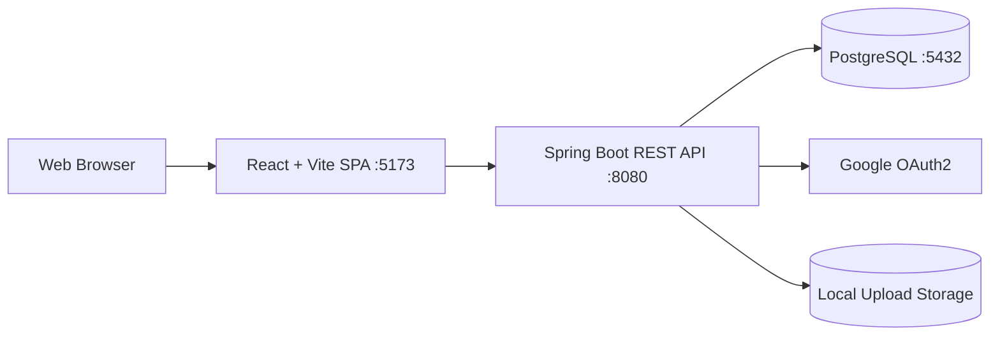
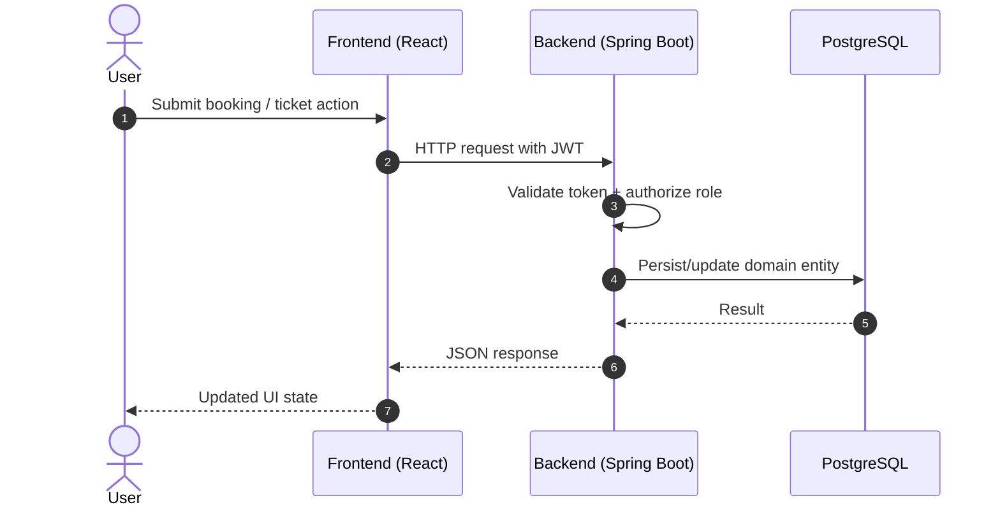

# Campus Operations Hub

Enterprise-style smart campus operations platform for facility discovery, booking workflows, maintenance ticketing, and real-time user notifications.


This repository contains:

- `server`: Spring Boot backend API
- `client`: React + Vite frontend

## Table of Contents

- [Project Overview](#project-overview)
- [Key Capabilities](#key-capabilities)
- [Architecture](#architecture)
- [Technology Stack](#technology-stack)
- [Core Modules](#core-modules)
- [Getting Started](#getting-started)
- [Configuration](#configuration)
- [Run the Project](#run-the-project)
- [Scripts Reference](#scripts-reference)
- [Testing and Quality](#testing-and-quality)
- [API Overview](#api-overview)
- [Security Model](#security-model)
- [CI Pipeline](#ci-pipeline)
- [Repository Structure](#repository-structure)
- [Troubleshooting](#troubleshooting)
- [Team Ownership](#team-ownership)
- [Contributing](#contributing)

## Project Overview

Campus Operations Hub is a full-stack platform designed to centralize day-to-day campus operations:

- Secure authentication with JWT and Google OAuth2
- Facility/resource search and administration
- Booking requests with approval and lifecycle updates
- Maintenance/incident ticketing with comments and attachments
- In-app notifications and unread tracking

## Key Capabilities

- Role-aware access control for user/admin/technician flows
- Full booking lifecycle: create, review, approve/reject, cancel
- Ticket collaboration with threaded comments and assignment
- Attachment support for ticket evidence files
- OpenAPI documentation for fast integration and QA
- CI-backed backend verification on push and pull requests

## Architecture



```text
React (Vite) SPA  --->  Spring Boot REST API  --->  PostgreSQL
      :5173                    :8080                :5432
                               |
                         OAuth2 (Google)
                               |
                          JWT Security
```

### Request Lifecycle



## Technology Stack

### Frontend

- React 19
- React Router 7
- Vite 8
- ESLint 9

### Backend

- Java 17
- Spring Boot 4
- Spring Security + OAuth2 Client
- Spring Data JPA + Hibernate
- JWT (jjwt)
- SpringDoc OpenAPI (Swagger UI)

### Data and Infra

- PostgreSQL 15
- Maven Wrapper (`mvnw`, `mvnw.cmd`)
- GitHub Actions CI

## Core Modules

- Authentication and session context
- Facilities/resource catalog
- Booking workflow and approvals
- Ticket lifecycle and assignment
- Notifications (list, unread counters, mark as read)

## Getting Started

### Prerequisites

- Node.js 18+
- Java 17+
- PostgreSQL 15+
- Maven 3.9+ (optional if you use Maven Wrapper)

Quick checks:

```bash
node -v
java -version
psql --version
```

### Local Environment Checklist

- PostgreSQL running locally on port `5432`
- OAuth2 client configured in Google Cloud
- Frontend available at `http://localhost:5173`
- Backend available at `http://localhost:8080`
- Upload folders writable by the backend process

## Configuration

The backend uses defaults in `server/src/main/resources/application.properties`.

Default local values:

- API port: `8080`
- Frontend URL: `http://localhost:5173`
- DB URL: `jdbc:postgresql://localhost:5432/campus_op_hub`
- Upload directory: `./uploads`

You can override settings using environment variables (recommended):

```bash
SPRING_DATASOURCE_URL=jdbc:postgresql://localhost:5432/campus_op_hub
SPRING_DATASOURCE_USERNAME=campus_user
SPRING_DATASOURCE_PASSWORD=campus123

APP_JWT_SECRET=<base64-secret>
APP_JWT_EXPIRATION_MS=86400000
APP_UPLOAD_DIR=./uploads
APP_FRONTEND_URL=http://localhost:5173

SPRING_SECURITY_OAUTH2_CLIENT_REGISTRATION_GOOGLE_CLIENT_ID=<google-client-id>
SPRING_SECURITY_OAUTH2_CLIENT_REGISTRATION_GOOGLE_CLIENT_SECRET=<google-client-secret>
```

### Recommended Environment Files

You can use shell-specific env files to avoid committing secrets:

- `.env.local` for frontend values
- shell profile or secure secret manager for backend credentials
- copy `.env.example` and fill local values in your own private env file (do not commit)

Never commit real OAuth secrets or production JWT secrets.

### PostgreSQL setup

Create local user/database (adapt credentials as needed):

```sql
CREATE USER campus_user WITH PASSWORD 'campus123';
CREATE DATABASE campus_op_hub OWNER campus_user;
GRANT ALL PRIVILEGES ON DATABASE campus_op_hub TO campus_user;
```

### Persistent local database (recommended)

To avoid losing data between project restarts or PC reboots, run PostgreSQL through Docker with a named volume:

```powershell
cd "D:\Coding\Campus Operation HUB"
docker compose up -d postgres
```

This repository includes `docker-compose.yml` with a persistent volume:

- Service: `postgres` (`postgres:15`)
- DB: `campus_op_hub`
- User: `campus_user`
- Password: `campus123`
- Persistent volume: `campus_ops_pgdata`

Verify your app is connected to this same database:

```sql
SELECT current_database(), current_user;
SHOW data_directory;
```

Do not run `docker compose down -v` unless you intentionally want to delete all local DB data.

For CI-like test runs, a dedicated database is commonly used:

```sql
CREATE USER campus_user WITH PASSWORD 'campus123';
CREATE DATABASE campus_ops_test OWNER campus_user;
GRANT ALL PRIVILEGES ON DATABASE campus_ops_test TO campus_user;
```

If you only have one local database (for example `campus_op_hub`), override test datasource values when running tests:

```powershell
$env:SPRING_DATASOURCE_URL="jdbc:postgresql://localhost:5432/campus_op_hub"
$env:SPRING_DATASOURCE_USERNAME="campus_user"
$env:SPRING_DATASOURCE_PASSWORD="campus123"
cd server
.\mvnw.cmd test
```

### Google OAuth2 setup

1. Open Google Cloud Console.
2. Create an OAuth 2.0 Client ID (Web application).
3. Add redirect URI:
   `http://localhost:8080/login/oauth2/code/google`
4. Provide client ID/secret through environment variables.

### Production Configuration Notes

- Set `spring.jpa.hibernate.ddl-auto` appropriately (avoid `update` for strict production workflows)
- Use a dedicated object storage provider instead of local `./uploads` if needed
- Rotate JWT secrets and OAuth secrets regularly
- Put the API behind HTTPS reverse proxy

## Run the Project

Run frontend and backend in separate terminals.

### 0) Start persistent PostgreSQL (required for stable local data)

```powershell
cd "D:\Coding\Campus Operation HUB"
docker compose up -d postgres
```

Optional checks:

```powershell
docker compose ps
docker volume ls
```

### 1) Start backend (Spring Boot)

```bash
cd server
./mvnw spring-boot:run
```

Windows:

```powershell
cd server
.\mvnw.cmd spring-boot:run
```

Backend endpoints:

- API base: `http://localhost:8080`
- Swagger UI: `http://localhost:8080/swagger-ui/index.html`
- OpenAPI: `http://localhost:8080/v3/api-docs`

### 2) Start frontend (React + Vite)

```bash
cd client
npm install
npm run dev
```

Frontend app:

- `http://localhost:5173`

### Quick Start (2 terminals)

Terminal 1:

```powershell
cd "D:\Coding\Campus Operation HUB"
docker compose up -d postgres
cd server
.\mvnw.cmd spring-boot:run
```

Terminal 2:

```powershell
cd client
npm install
npm run dev
```

## Scripts Reference

### Frontend scripts

| Script | Command | Purpose |
|--------|---------|---------|
| Dev server | `npm run dev` | Start Vite development server |
| Build | `npm run build` | Create optimized production build |
| Lint | `npm run lint` | Run ESLint checks |
| Preview | `npm run preview` | Preview built frontend locally |

### Backend commands

| Command | Purpose |
|---------|---------|
| `./mvnw spring-boot:run` | Run backend in dev mode |
| `./mvnw test` | Execute test suite |
| `./mvnw compile` | Compile backend sources |

## Testing and Quality

### Backend tests

```bash
cd server
./mvnw test
```

Windows:

```powershell
cd server
.\mvnw.cmd test
```

### Frontend lint and production build

```bash
cd client
npm run lint
npm run build
```

### Definition of Ready for Merge

- Backend tests pass
- Frontend lint and build pass
- Swagger endpoint is reachable locally
- New or changed endpoints are documented

## API Overview

Base URL: `http://localhost:8080`

### Health and Auth

| Method | Endpoint | Access | Description |
|--------|----------|--------|-------------|
| GET | `/api/health` | Public | Service health probe |
| GET | `/api/auth/health` | Public | Auth service health probe |
| GET | `/oauth2/authorization/google` | Public | Start Google OAuth2 login |
| GET | `/api/auth/me` | Authenticated | Get current user summary |

### Resources

| Method | Endpoint | Access |
|--------|----------|--------|
| GET | `/api/resources` | Public |
| GET | `/api/resources/{id}` | Public |
| POST | `/api/resources` | Admin |
| PUT | `/api/resources/{id}` | Admin |
| DELETE | `/api/resources/{id}` | Admin |

### Bookings

| Method | Endpoint | Access |
|--------|----------|--------|
| POST | `/api/bookings` | Authenticated |
| GET | `/api/bookings/my` | Authenticated |
| GET | `/api/bookings` | Admin |
| GET | `/api/bookings/{id}` | Authenticated |
| PATCH | `/api/bookings/{id}/approve` | Admin |
| PATCH | `/api/bookings/{id}/reject` | Admin |
| PATCH | `/api/bookings/{id}/cancel` | Authenticated |

### Tickets and Comments

| Method | Endpoint | Access |
|--------|----------|--------|
| POST | `/api/tickets` | Authenticated |
| GET | `/api/tickets` | Authenticated |
| GET | `/api/tickets/my` | Authenticated |
| GET | `/api/tickets/{id}` | Authenticated |
| PATCH | `/api/tickets/{id}/status` | Admin or Technician |
| PATCH | `/api/tickets/{id}/assign` | Admin |
| POST | `/api/tickets/{ticketId}/comments` | Authenticated |
| DELETE | `/api/tickets/{ticketId}/comments/{commentId}` | Authenticated |
| DELETE | `/api/tickets/{id}` | Admin |

### Notifications

| Method | Endpoint | Access |
|--------|----------|--------|
| GET | `/api/notifications` | Authenticated |
| GET | `/api/notifications/unread-count` | Authenticated |
| PATCH | `/api/notifications/read-all` | Authenticated |
| PATCH | `/api/notifications/{id}/read` | Authenticated |

For complete contracts, use Swagger UI.

## Security Model

- Authentication: JWT bearer tokens + Google OAuth2 login entrypoint
- Authorization: endpoint-level role checks (User/Admin/Technician)
- Sensitive values: provided via environment variables
- File uploads: multipart limits enforced in backend config
- Operational recommendation: enable HTTPS and secure secret storage in non-local environments

## CI Pipeline

GitHub Actions workflow: `.github/workflows/ci.yml`

- Triggers on pushes to `main`, `development`, and `feature/**`
- Runs backend compile + tests
- Provisions PostgreSQL 15 service in CI
- Injects test-specific environment variables at runtime

### CI Scope

- Backend compile
- Backend tests
- PostgreSQL service health checks

## Repository Structure

```text
.
|-- client/                      # React + Vite frontend
|   |-- src/
|   |-- package.json
|-- server/                      # Spring Boot backend
|   |-- src/main/java/
|   |-- src/main/resources/
|   |-- src/test/java/
|   |-- pom.xml
|-- CONTRIBUTING.md
`-- README.md
```

## Troubleshooting

### Backend cannot connect to PostgreSQL

- Confirm PostgreSQL service is running
- Verify URL/user/password in environment variables
- Check port conflicts on `5432`

### Google OAuth fails on redirect

- Ensure redirect URI exactly matches:
      `http://localhost:8080/login/oauth2/code/google`
- Ensure correct OAuth client ID/secret values are loaded

### Frontend cannot reach API

- Confirm backend is running on `http://localhost:8080`
- Verify CORS/security configuration for local frontend URL

### File uploads fail

- Ensure upload directory exists and is writable
- Check multipart limits in backend properties

### Data disappears after restart/reboot

- Ensure PostgreSQL is started through `docker compose up -d postgres`
- Do not run `docker compose down -v` (this deletes DB volume/data)
- In DBeaver, reconnect and refresh navigator after restarting services
- Verify you are connected to the expected DB:

```sql
SELECT current_database(), current_user;
SHOW data_directory;
SELECT COUNT(*) FROM public.users;
```

## Team Ownership

| Role | Module Area | Main Endpoint Groups |
|------|-------------|----------------------|
| Leader | Auth + Notifications | `/api/auth/**`, `/api/notifications/**` |
| Member 2 | Facilities | `/api/resources/**` |
| Member 3 | Bookings | `/api/bookings/**` |
| Member 4 | Tickets | `/api/tickets/**`, `/api/tickets/{id}/comments/**` |

## Contributing

Use the team workflow documented in `CONTRIBUTING.md`.

Recommended flow:

1. Branch from `development`.
2. Keep commits focused and descriptive.
3. Rebase/merge frequently from integration branch.
4. Open PR with test results and scope summary.

---

For onboarding support, start with the Quick Start section, then validate API health and Swagger access before implementing module features.
